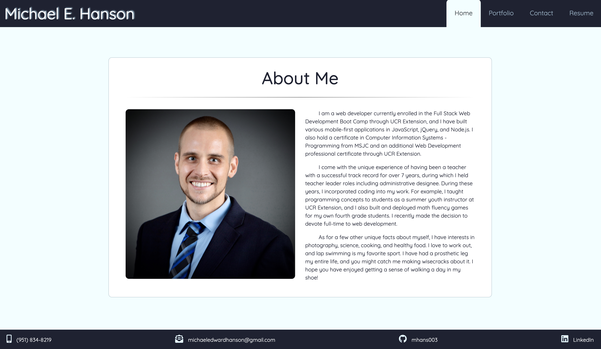
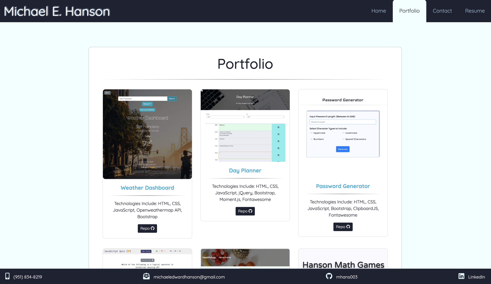

# Michael Hanson's Responsive Portfolio 

### Deployed Application 

[Responsive Portfolio - Micael Hanson](https://mhans003.github.io/portfolio/index.html)

### Description

This is Michael Hanson's online responsive portfolio. 

This mobile-first website provides Michael Hanson's bio, contact information, and portfolio of online work. 

### Features

* Bootstrap 4 components including grid, navbar, cards, and modals 
* Responsive to a wide variety of screen sizes using Bootstrap and supporting Media Queries
* Alt tags with image descriptions 
* Font Awesome icons in footer that link to social media
* Semantic HTML tags for organization and SEO enhancement 

### License

Licensed under the [MIT License](./LICENSE.txt).

